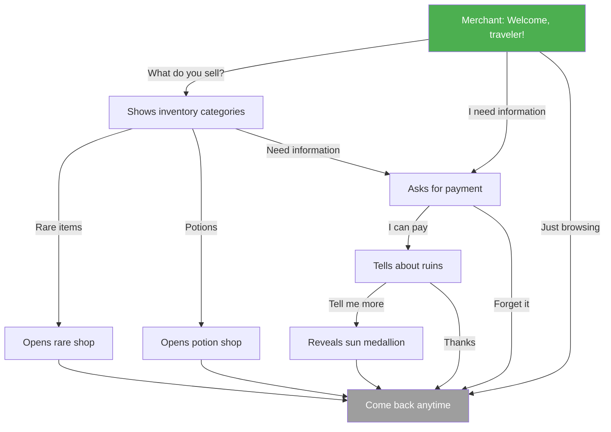

# 游戏Skill · character-design-narrative · dialogue-tree

> 来源：fcsouza/agent-skills
> 原始链接：https://github.com/fcsouza/agent-skills/tree/main/skills/character-design-narrative
> 分类：gameplay
> 标签：游戏策划, 角色设计, Agent Skill

## 概述
游戏开发Skill：character-design-narrative

## 正文
# Dialogue Tree Format Template

Use this format to author branching dialogue. Each dialogue is a graph of nodes connected by player choices.

---

## Dialogue Metadata

| Field | Value |
|-------|-------|
| **Dialogue ID** | _e.g., DLG-MERCHANT-001_ |
| **Participants** | _Player, Merchant NPC_ |
| **Trigger** | _Player interacts with Merchant in Town Square_ |
| **Prerequisites** | _Quest "Find the Market" completed_ |
| **Context** | _First time meeting, or returning customer_ |

---

## Node Table

Each row is one dialogue node. The player sees the Speaker's Line, then picks from Options.

| Node ID | Speaker | Line | Options |
|---------|---------|------|---------|
| N01 | Merchant | "Welcome, traveler! Looking for something special?" | 1: "What do you sell?" → N02 / 2: "I'm looking for information." → N03 / 3: "Just browsing." → N_END |
| N02 | Merchant | "I've got potions, scrolls, and a few rare items if you've got the coin." | 1: "Show me rare items." → N04 / 2: "I'll take a look at potions." → N05 / 3: "Actually, I need information." → N03 |
| N03 | Merchant | "Information? That depends on the topic... and whether you can pay." | 1: "I can pay. Tell me about the ruins." → N06 / 2: "Forget it." → N_END |
| N04 | Merchant | "Ah, a collector. Let me show you what I have in the back." | _(Opens rare shop inventory)_ → N_END |
| N05 | Merchant | "Standard stock. Take your pick." | _(Opens potion shop inventory)_ → N_END |
| N06 | Merchant | "The ruins to the north? Dangerous place. But there's treasure if you survive." | 1: "Tell me more." → N07 / 2: "Thanks, that's enough." → N_END |
| N07 | Merchant | "They say there's a sealed door on the third level. You'll need a sun medallion to open it." | _(Set flag: knows_sun_medallion)_ → N_END |
| N_END | Merchant | "Come back anytime, friend." | _(End dialogue)_ |

---

## Conditions Table

Conditions gate which nodes or options are available.

| Applies To | Condition Type | Condition | Effect |
|------------|---------------|-----------|--------|
| N04 (option 1) | item_held | gold >= 500 | Option visible only if player has 500+ gold |
| N06 | flag_set | merchant_trust >= 1 | Node accessible only if player has merchant trust |
| N03 → N06 | quest_completed | quest_find_market | Required to ask about ruins |
| N07 | first_visit | dlg_merchant_001 | Only show sun medallion info on first conversation |

---

## Effects Table

Effects are triggered when a node is reached or an option is chosen.

| Trigger | Effect Type | Details |
|---------|------------|---------|
| N07 reached | set_flag | `knows_sun_medallion = true` |
| N04 option selected | open_shop | `shop_id: merchant_rare` |
| N05 option selected | open_shop | `shop_id: merchant_potions` |
| N06 reached | change_reputation | `merchant_trust += 1` |
| N03 option 1 selected | remove_item | `gold -= 50` |

---

## Dialogue Flow Diagram

---

## Authoring Guidelines

1. **Every node needs an exit**: No dead ends. Always provide at least one option or auto-advance.
2. **Keep lines concise**: Target 1-2 sentences per speaker line. Players skim long dialogue.
3. **Conditions should be discoverable**: If an option requires a flag, the player should have a reasonable way to learn about it.
4. **Effects happen immediately**: When a node triggers a flag or item change, it takes effect before the next node renders.
5. **Track all flags**: Maintain a master list of dialogue flags and which dialogues set/check them.
6. **Voice budget**: If dialogue will be voice-acted, note word count per node. Target < 30 words per line.

## 策划参考价值
游戏叙事/设计Skill参考。分类：角色设计
