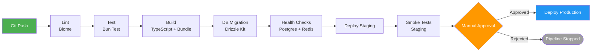
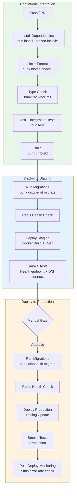

# 游戏Skill · ci-cd-game · ARCHITECTURE

> 来源：fcsouza/agent-skills
> 原始链接：https://github.com/fcsouza/agent-skills/tree/main/skills/ci-cd-game
> 分类：gameplay
> 标签：游戏策划, 游戏开发, Agent Skill

## 概述
游戏开发Skill：ci-cd-game

## 正文
# CI/CD Pipeline — Architecture

## Pipeline Overview



## Detailed Stage Diagram



## GitHub Actions Workflow Structure

```
.github/workflows/
├── ci.yml              # Runs on every push and PR
├── deploy-staging.yml  # Runs on merge to main
└── deploy-prod.yml     # Manual trigger after staging approval
```

## Stage Details

### 1. Lint (Biome)

- Runs `bunx biome check .` to catch formatting and lint errors
- Fails fast: if lint fails, no further stages run
- Uses Biome config from `biome.json` / `biome.jsonc`

### 2. Test (Bun)

- Runs `bun test` for unit and integration tests
- Tests run against a local Postgres (via service container) and Redis
- Target: all tests pass, > 80% coverage on critical paths

### 3. Build

- TypeScript compilation and bundling
- Validates all imports resolve correctly
- Produces deployable artifacts

### 4. Database Migration

- Runs `bunx drizzle-kit migrate` against the target environment
- Migrations are idempotent and backward-compatible
- Staging runs first; production only after staging succeeds

### 5. Redis Health Check

- Verifies Redis is reachable and responsive
- Checks that required Redis data structures exist
- Timeout: 30 seconds

### 6. Deploy

- **Staging**: automatic on merge to `main`
- **Production**: manual approval required after staging smoke tests pass
- Rolling update strategy: zero downtime
- Automatic rollback if health checks fail within 5 minutes

### 7. Smoke Tests

- Hit `/health` endpoint, verify 200
- Open WebSocket connection, verify handshake
- Run one matchmaking round-trip (staging only)

## Environment Variables

| Variable | Staging | Production |
|----------|---------|------------|
| `DATABASE_URL` | Staging Neon branch | Production Neon |
| `REDIS_HOST` | Staging Redis | Production Redis |
| `NODE_ENV` | `staging` | `production` |
| `LOG_LEVEL` | `debug` | `info` |

## Rollback Strategy

1. Automatic rollback if error rate > 5% within 5 minutes post-deploy
2. Manual rollback via re-deploying previous Docker image tag
3. Database migrations must be backward-compatible (no destructive changes)


## 策划参考价值
游戏叙事/设计Skill参考。分类：游戏开发
