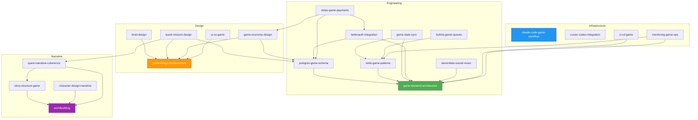

# 游戏Skill · claude-code-game-workflow · ARCHITECTURE

> 来源：fcsouza/agent-skills
> 原始链接：https://github.com/fcsouza/agent-skills/tree/main/skills/claude-code-game-workflow
> 分类：gameplay
> 标签：游戏策划, 游戏开发, Agent Skill

## 概述
游戏开发Skill：claude-code-game-workflow

## 正文
# Skill Dependency Graph — Architecture

## All 21 Skills



## Dependency Table

| Skill | Domain | Prerequisites |
|-------|--------|---------------|
| game-backend-architecture | Engineering | _(none — foundational)_ |
| postgres-game-schema | Engineering | game-backend-architecture |
| redis-game-patterns | Engineering | game-backend-architecture |
| game-state-sync | Engineering | game-backend-architecture, redis-game-patterns |
| bullmq-game-queues | Engineering | redis-game-patterns |
| betterauth-integration | Engineering | game-backend-architecture, postgres-game-schema |
| stripe-game-payments | Engineering | betterauth-integration, postgres-game-schema, game-economy-design |
| elevenlabs-sound-music | Engineering | game-backend-architecture |
| game-design-fundamentals | Design | _(none — foundational)_ |
| level-design | Design | game-design-fundamentals |
| quest-mission-design | Design | game-design-fundamentals, quest-narrative-coherence, postgres-game-schema |
| game-economy-design | Design | game-design-fundamentals, postgres-game-schema |
| ui-ux-game | Design | game-design-fundamentals |
| worldbuilding | Narrative | _(none — foundational)_ |
| story-structure-game | Narrative | worldbuilding |
| character-design-narrative | Narrative | worldbuilding |
| quest-narrative-coherence | Narrative | worldbuilding, story-structure-game |
| claude-code-game-workflow | Infrastructure | _(none — orchestrator)_ |
| cursor-codex-integration | Infrastructure | _(none — tooling)_ |
| ci-cd-game | Infrastructure | game-backend-architecture |
| monitoring-game-ops | Infrastructure | game-backend-architecture, redis-game-patterns |

## Reading Order for New Projects

```
1. claude-code-game-workflow     (understand the skill ecosystem)
2. game-design-fundamentals      (define your game's core loop)
3. worldbuilding                 (establish the world)
4. game-backend-architecture     (set up the server)
5. postgres-game-schema          (define the data model)
6. redis-game-patterns           (set up caching and pub/sub)
7. betterauth-integration        (add authentication)
8. ... (remaining skills as needed)
```

## Foundational Skills (No Prerequisites)

These four skills are entry points — read them first in their respective domains:

- **Engineering**: `game-backend-architecture`
- **Design**: `game-design-fundamentals`
- **Narrative**: `worldbuilding`
- **Infrastructure**: `claude-code-game-workflow`

## Cross-Domain Bridges

Some skills bridge multiple domains:

| Bridge | From | To | Why |
|--------|------|-----|-----|
| quest-mission-design | Design | Engineering + Narrative | Quests need DB schema and narrative coherence |
| game-economy-design | Design | Engineering | Economy needs DB tables and payment integration |
| stripe-game-payments | Engineering | Design | Payment SKUs come from economy design |
| monitoring-game-ops | Infrastructure | Engineering | Monitors the game server and queues |


## 策划参考价值
游戏叙事/设计Skill参考。分类：游戏开发
