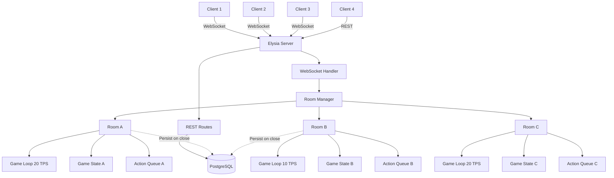
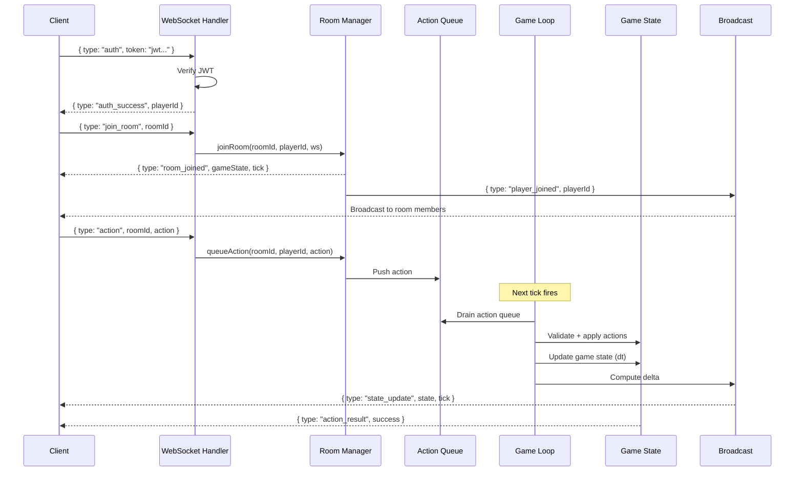
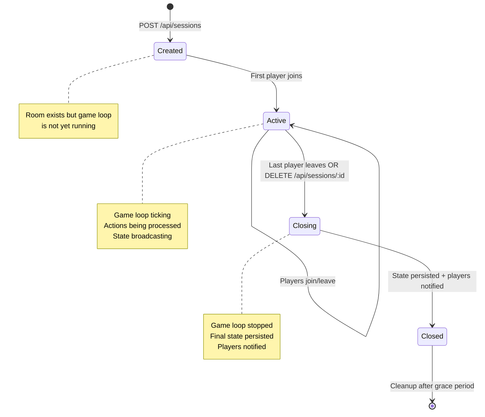
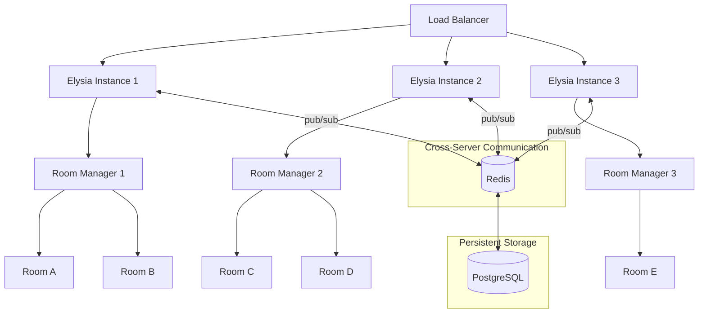
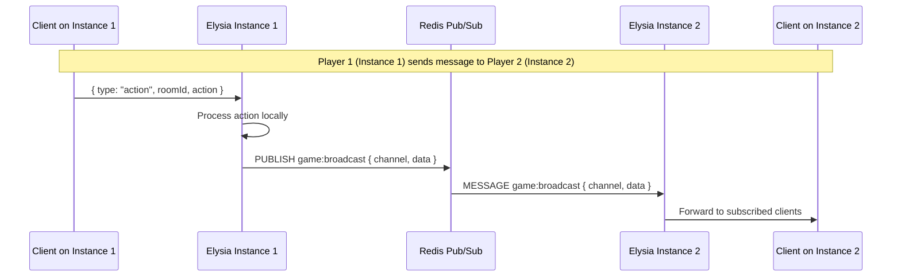
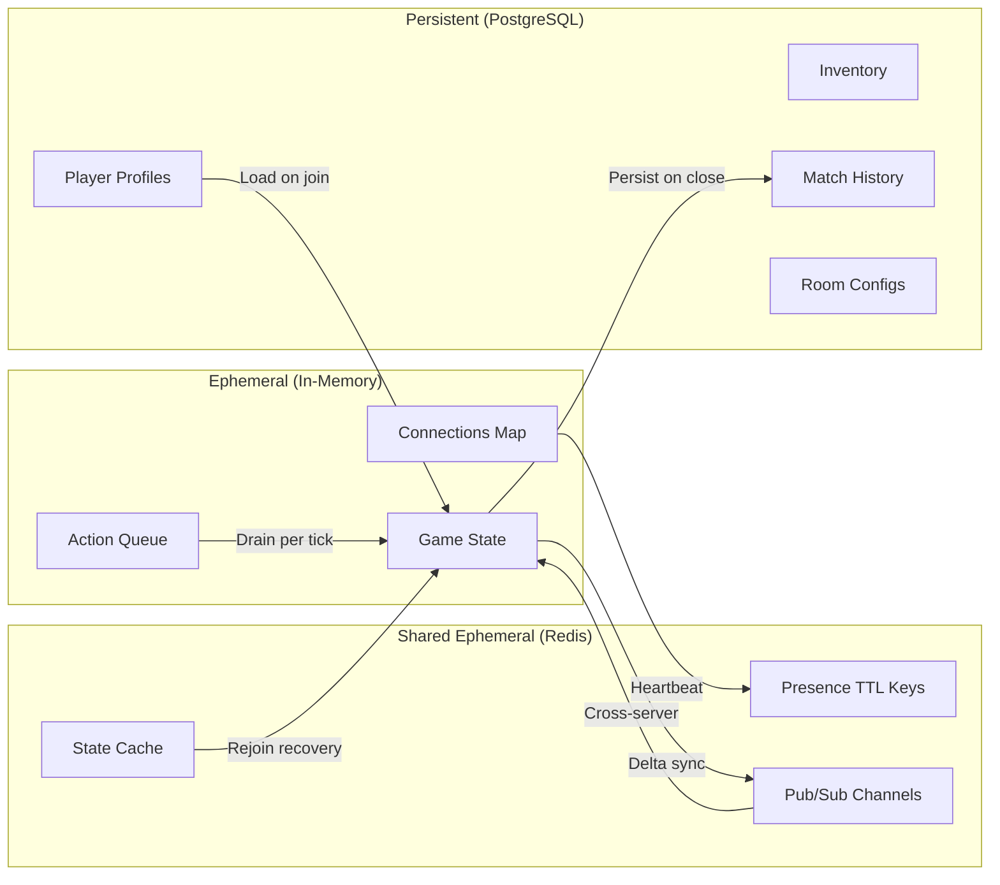

# 游戏Skill · game-backend-architecture · ARCHITECTURE

> 来源：fcsouza/agent-skills
> 原始链接：https://github.com/fcsouza/agent-skills/tree/main/skills/game-backend-architecture
> 分类：gameplay
> 标签：游戏策划, 游戏开发, Agent Skill

## 概述
游戏开发Skill：game-backend-architecture

## 正文
# Architecture Diagrams

## Server Topology

How a single Elysia instance organizes rooms and game loops.

## Message Flow

Complete lifecycle of a player action from client to broadcast.

## Room Lifecycle

State transitions for a room from creation to cleanup.

## Scaling Pattern

Multiple Elysia instances communicating via Redis pub/sub.

### Scaling Flow Detail

## Data Flow Overview

Where each type of data lives and how it flows.

## 策划参考价值
游戏叙事/设计Skill参考。分类：游戏开发
