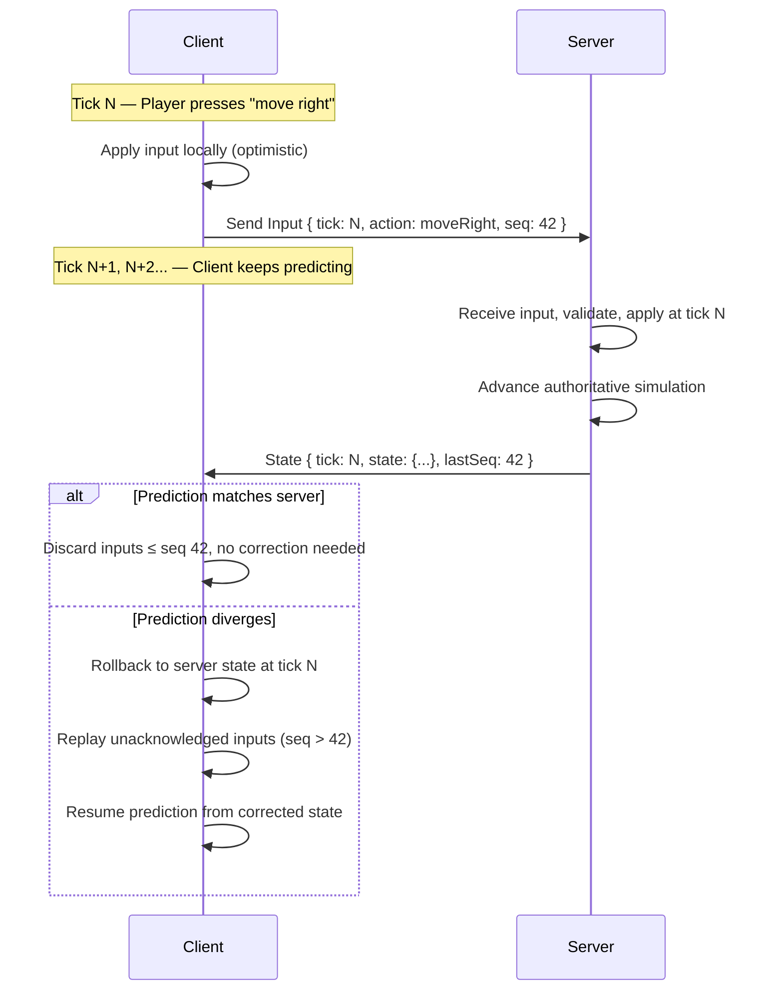
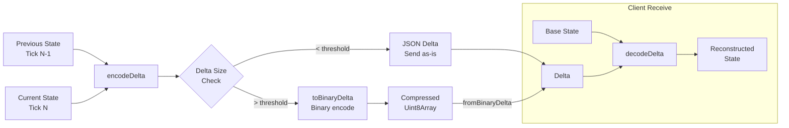
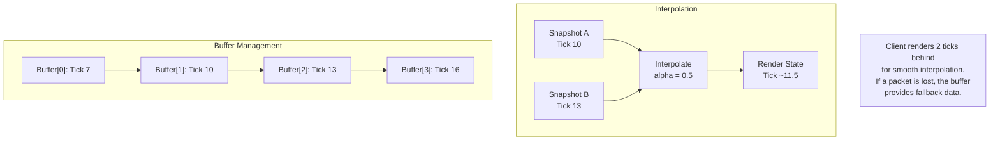
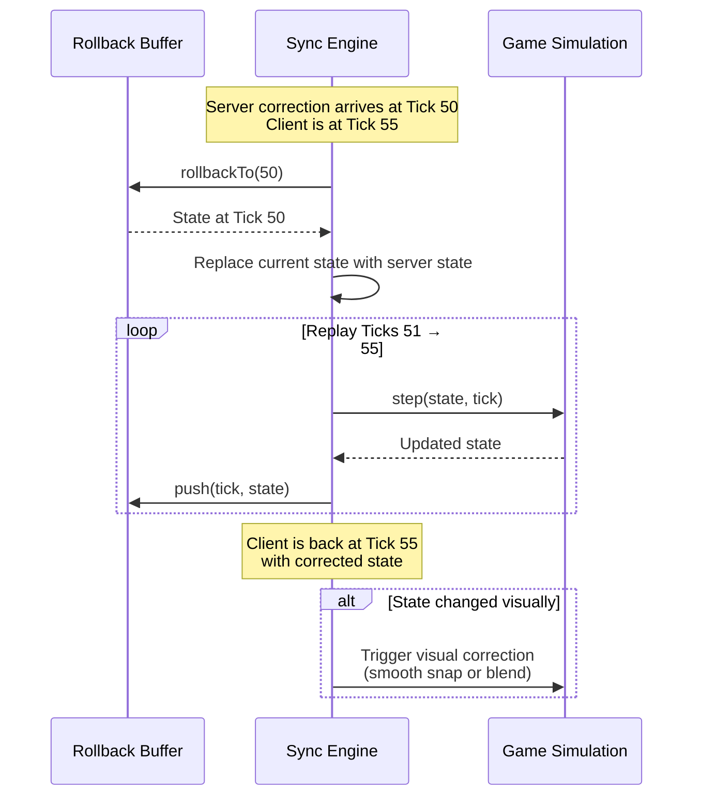
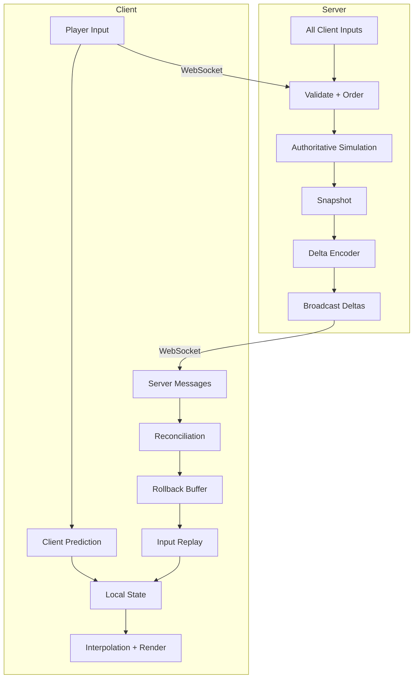

# 游戏Skill · game-state-sync · ARCHITECTURE

> 来源：fcsouza/agent-skills
> 原始链接：https://github.com/fcsouza/agent-skills/tree/main/skills/game-state-sync
> 分类：gameplay
> 标签：游戏策划, 游戏开发, Agent Skill

## 概述
游戏开发Skill：game-state-sync

## 正文
# Game State Sync — Architecture

## Client Prediction + Server Reconciliation

## Delta Compression Pipeline

## Snapshot Interpolation Timeline

```mermaid
gantt
    title Snapshot Interpolation
    dateFormat X
    axisFormat %s

    section Server Ticks
    Tick 10 (snapshot)    :milestone, 10, 0
    Tick 11               :milestone, 11, 0
    Tick 12               :milestone, 12, 0
    Tick 13 (snapshot)    :milestone, 13, 0
    Tick 14               :milestone, 14, 0
    Tick 15               :milestone, 15, 0
    Tick 16 (snapshot)    :milestone, 16, 0

    section Client Render
    Interpolation buffer  :active, 10, 12
    Render point          :crit, 11, 12
```

## Rollback Sequence

## Full System Overview

## 策划参考价值
游戏叙事/设计Skill参考。分类：游戏开发
