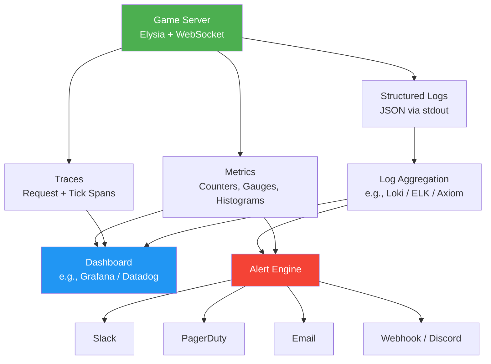

# 游戏Skill · monitoring-game-ops · ARCHITECTURE

> 来源：fcsouza/agent-skills
> 原始链接：https://github.com/fcsouza/agent-skills/tree/main/skills/monitoring-game-ops
> 分类：gameplay
> 标签：游戏策划, 游戏开发, Agent Skill

## 概述
游戏开发Skill：monitoring-game-ops

## 正文
# Monitoring & Game Ops — Architecture

## Observability Stack



## Data Flow

1. **Game Server** emits structured JSON logs to stdout and metrics to a collector.
2. **Log Aggregation** indexes logs for search, filtering, and alerting.
3. **Metrics** are scraped or pushed to a time-series database.
4. **Dashboard** provides real-time and historical visualization.
5. **Alert Engine** evaluates rules against metrics and logs, sends notifications.

## Key Metrics

| Category | Metric | Type | Target | Alert Threshold |
|----------|--------|------|--------|----------------|
| Server | Tick time (p95) | Histogram | < 16ms | > 50ms |
| Server | API response (p95) | Histogram | < 200ms | > 500ms |
| Server | Concurrent players | Gauge | N/A | > 80% capacity |
| Server | Memory usage (%) | Gauge | < 70% | > 85% |
| Server | Error rate (%) | Counter | < 1% | > 5% |
| Server | WebSocket disconnect rate | Counter | < 5/min | > 50/min |
| Queue | Waiting jobs | Gauge | < 100 | > 500 |
| Queue | Processing time (p95) | Histogram | < 5s | > 30s |
| Game | Match duration (p95) | Histogram | < 30min | > 60min |
| Game | Matchmaking wait (p95) | Histogram | < 30s | > 120s |
| Economy | Balance ratio | Gauge | ~0 | > 0.3 |
| Economy | Transaction volume | Counter | Baseline | > 3x baseline |

## Log Format

All logs use structured JSON via the `GameLogger` class:

```json
{
  "level": "info",
  "message": "request_end",
  "timestamp": "2026-01-15T10:30:00.000Z",
  "context": {
    "service": "game-server",
    "component": "http",
    "requestId": "abc-123",
    "playerId": "player-456"
  },
  "data": {
    "method": "GET",
    "url": "/api/players/player-456",
    "status": 200,
    "durationMs": 12.5
  }
}
```

## Alert Severity Levels

| Severity | Response Time | Action |
|----------|--------------|--------|
| **Info** | Next business day | Review in standup |
| **Warning** | Within 4 hours | Investigate, may need action |
| **Critical** | Within 30 minutes | Immediate investigation required |
| **Fatal** | Immediate | All hands, service is down |

## Files in This Skill

| File | Purpose |
|------|---------|
| `boilerplate/logger.ts` | GameLogger class, request middleware, session logger |
| `templates/alert-config.ts` | AlertRule interface and preset alert definitions |


## 策划参考价值
游戏叙事/设计Skill参考。分类：游戏开发
