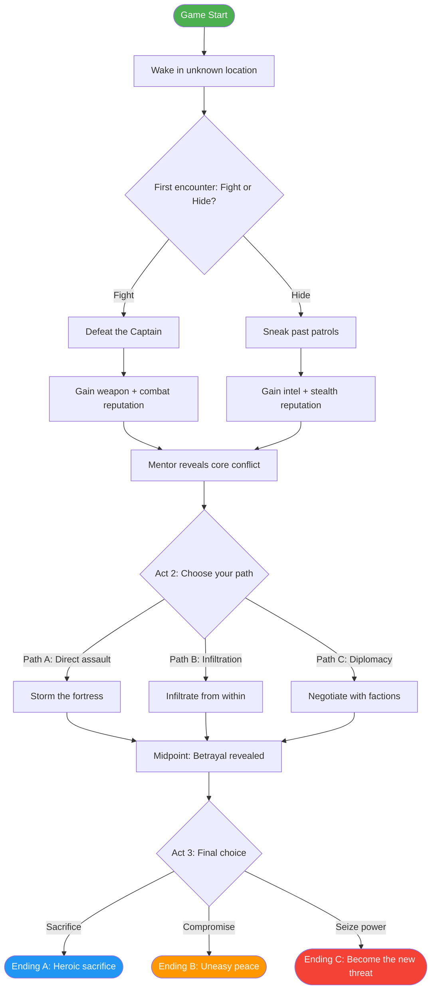

# 游戏Skill · story-structure-game · branching-diagram

> 来源：fcsouza/agent-skills
> 原始链接：https://github.com/fcsouza/agent-skills/tree/main/skills/story-structure-game
> 分类：gameplay
> 标签：游戏策划, 故事结构, Agent Skill

## 概述
游戏开发Skill：story-structure-game

## 正文
# Branching Narrative Diagram Template

Use this template to document branching story paths. Two formats are provided: Mermaid flowchart (for rendering) and indented list (for quick reference).

---

## Format 1: Mermaid Flowchart

Use this in any Markdown renderer that supports Mermaid (GitHub, GitLab, Obsidian, etc.).



### Node Types

| Shape | Meaning | Syntax |
|-------|---------|--------|
| `([text])` | Terminal (start/end) | `START([Game Start])` |
| `[text]` | Story beat (linear) | `BEAT_001[Description]` |
| `{text}` | Decision node (player choice) | `BEAT_002{Fight or Hide?}` |
| `-->` | Transition | `A --> B` |
| `-->\|label\|` | Labeled transition (choice text) | `A -->\|Fight\| B` |

---

## Format 2: Indented List

For quick documentation without rendering tools.

```
START: Game Start
├── BEAT-001: Wake in unknown location
│   └── BEAT-002: [CHOICE] First encounter — Fight or Hide?
│       ├── (Fight) BEAT-002A: Defeat the Captain
│       │   └── RESULT: Gain weapon + combat reputation
│       │       └── → MERGE → BEAT-003
│       └── (Hide) BEAT-002B: Sneak past patrols
│           └── RESULT: Gain intel + stealth reputation
│               └── → MERGE → BEAT-003
├── BEAT-003: Mentor reveals core conflict
│   └── ACT2: [CHOICE] Choose your path
│       ├── (Path A) Storm the fortress
│       ├── (Path B) Infiltrate from within
│       └── (Path C) Negotiate with factions
│           └── → ALL MERGE → MIDPOINT
├── MIDPOINT: Betrayal revealed
│   └── ACT3: [CHOICE] Final choice
│       ├── (Sacrifice) → ENDING A: Heroic sacrifice
│       ├── (Compromise) → ENDING B: Uneasy peace
│       └── (Seize power) → ENDING C: Become the new threat
```

### Legend

- `[CHOICE]` — Player decision point
- `→ MERGE →` — Branches converge to a single node
- `RESULT:` — Consequence of a choice
- `(Label)` — Choice option text

---

## Guidelines

1. **Decision nodes** should have 2-4 options maximum. More than 4 overwhelms players.
2. **Merge points** should feel natural, not forced. The world should reflect prior choices even after merging.
3. **Track variables**: Note which flags/variables each branch sets (e.g., `combat_reputation += 1`).
4. **Test all paths**: Every branch combination must be playable start-to-finish.
5. **Label endings clearly**: Use consistent naming (Ending A, B, C) and document how each is reached.
6. **Avoid dead ends**: Every node must lead somewhere. If a branch fails, redirect rather than terminate.


## 策划参考价值
游戏叙事/设计Skill参考。分类：故事结构
